# Benchmark Analysis
We have benchmarked how many samples per second different models can process
on different hardware devices.
Below are some results for 
[BERT-Squad](https://github.com/onnx/models/tree/master/text/machine_comprehension/bert-squad), 
[MobileNetV2](https://github.com/onnx/models/tree/master/vision/classification/mobilenet), 
[ResNet50](https://github.com/onnx/models/tree/master/vision/classification/resnet), 
[SuperResolution](https://github.com/onnx/models/tree/master/vision/super_resolution/sub_pixel_cnn_2016), 
[YOLOv4](https://github.com/onnx/models/tree/master/vision/object_detection_segmentation/yolov4) and
[FastNeuralStyleTransfer](https://github.com/onnx/models/tree/master/vision/style_transfer/fast_neural_style).  

We always used batch size of 1 which is relevant for real time request response applications.

### CPU
Benchmarks for 
[c5a.4xlarge](https://aws.amazon.com/about-aws/whats-new/2020/06/now-available-amazon-ec2-c5a-instances-featuring-2nd-generation-amd-epyc-processors/), 
an AWS EC2 CPU compute instance.
Higher is better.

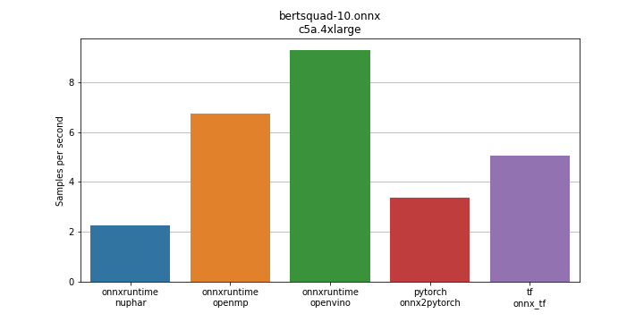
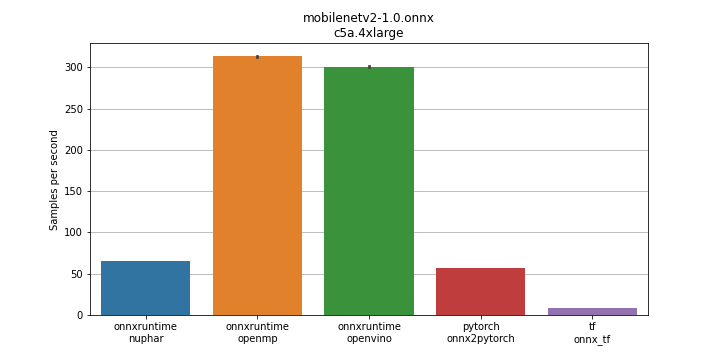
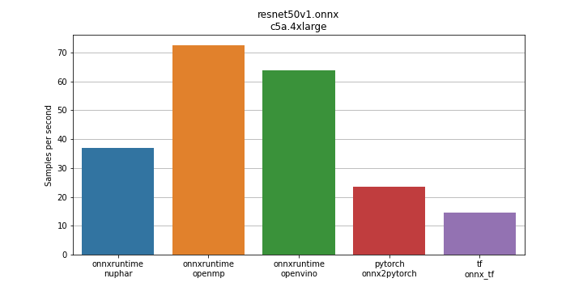
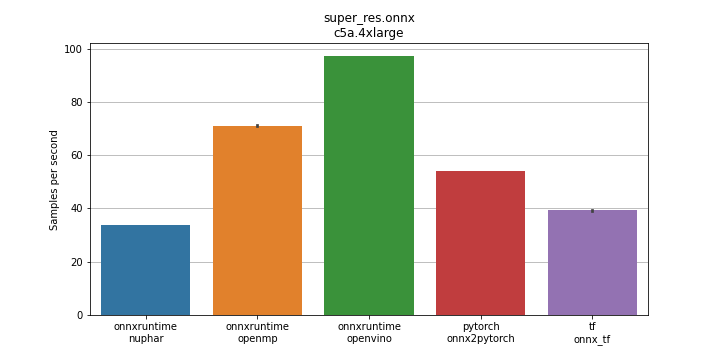
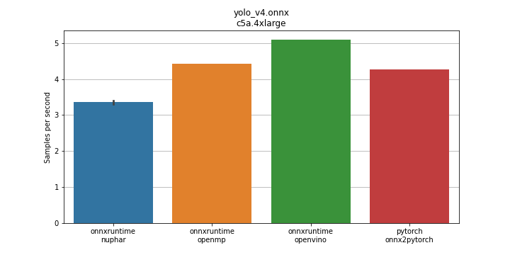
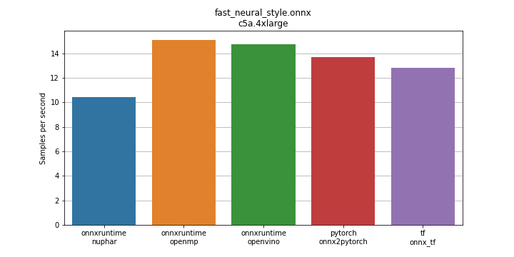

### GPU
Benchmarks for [g4dn.xlarge](https://aws.amazon.com/ec2/instance-types/g4/),
an AWS EC2 GPU instance.  
Some model conversions failed, that is why some backend results are missing.

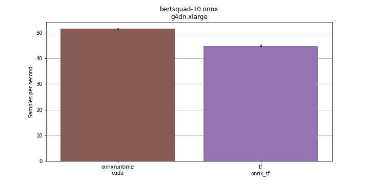
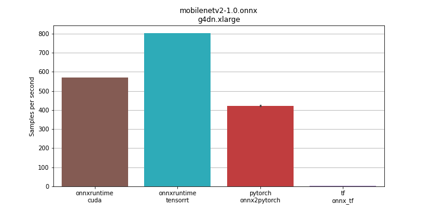
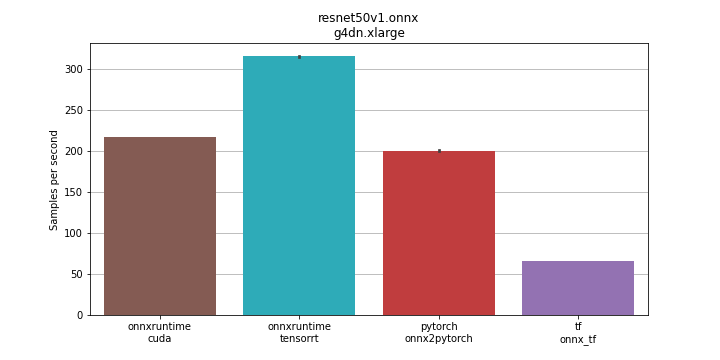
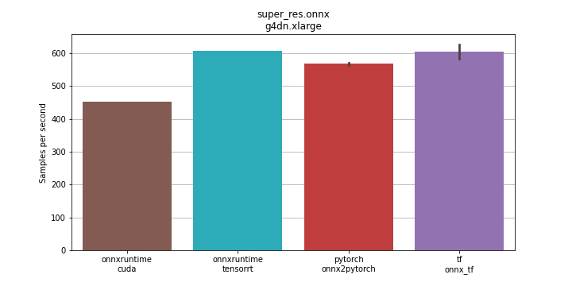
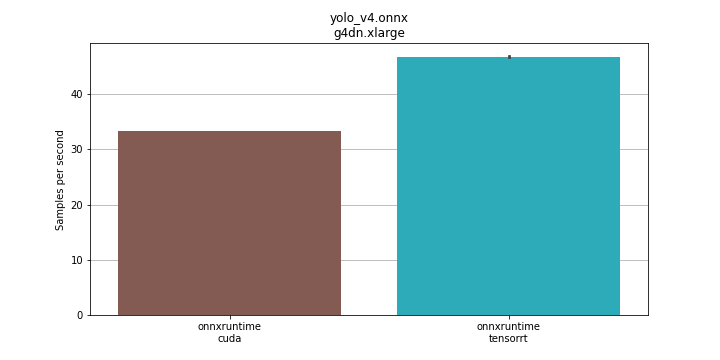
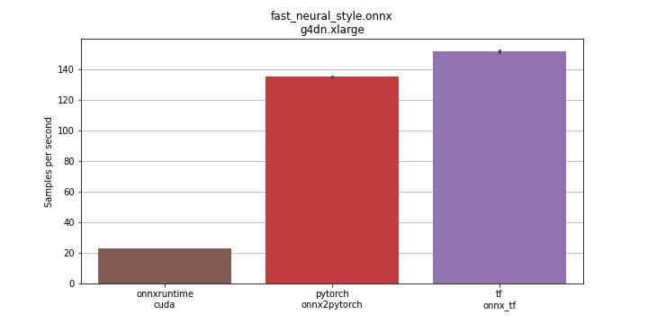

### CPU vs GPU vs ARM
Comparison of the following similarly priced AWS EC2 instances in the us-east-1 region.

| Instance Type | Device | Cost    |
| ------------- |:--------:| -------:|
| c5n.2xlarge   | CPU      | $0.432  |
| g4dn.xlarge   | GPU      | $0.526  |
| c6g.4xlarge   | ARM      | $0.544  |
| c5a.4xlarge   | CPU      | $0.616  |

Only the performance of the best backend for each of the instances is shown.  

More expensive instance does not always deliver higher throughput. 
Also, notice that the same model on the same device type (CPU) is sometimes faster using
one backend sometimes another.

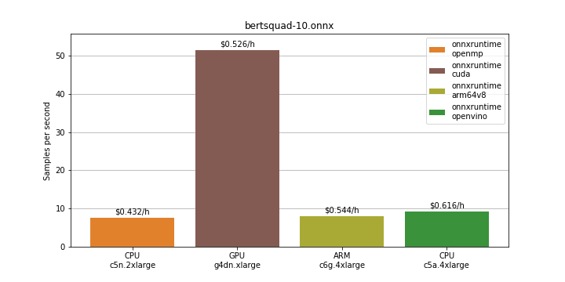
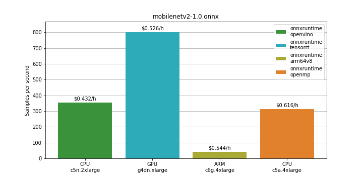
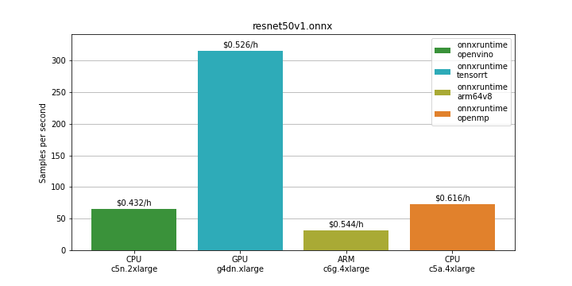
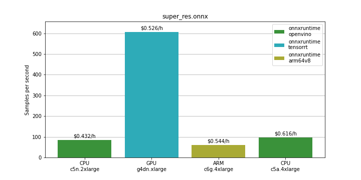
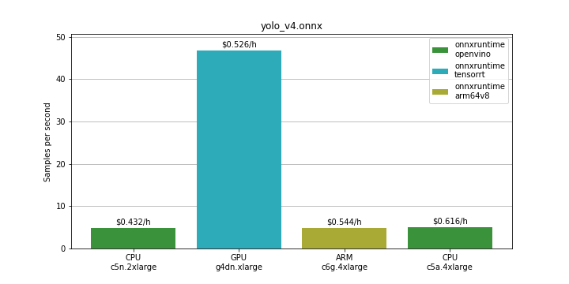
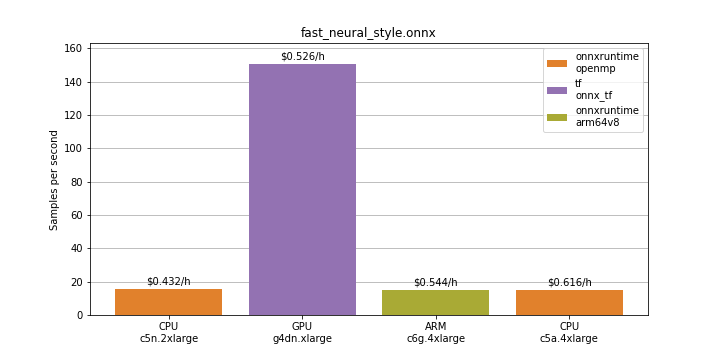

# Conclusion
If your application requires a large amount of requests per second the GPU seems 
to be the cheapest option to choose from. If your demands are lower, a cheaper 
compute instance or a group of them might be a better option. See the graph below.
Red dashed lines represent two applications with different requirements, 
y-axis is in logscale.  

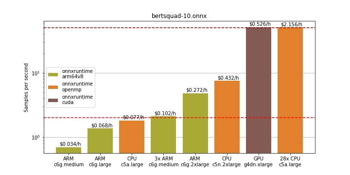

In any case,
running a DNN-Bench before deploying and identifying the best inference backend for your model can save you a 
lot of cost and increase your model's throughput.

